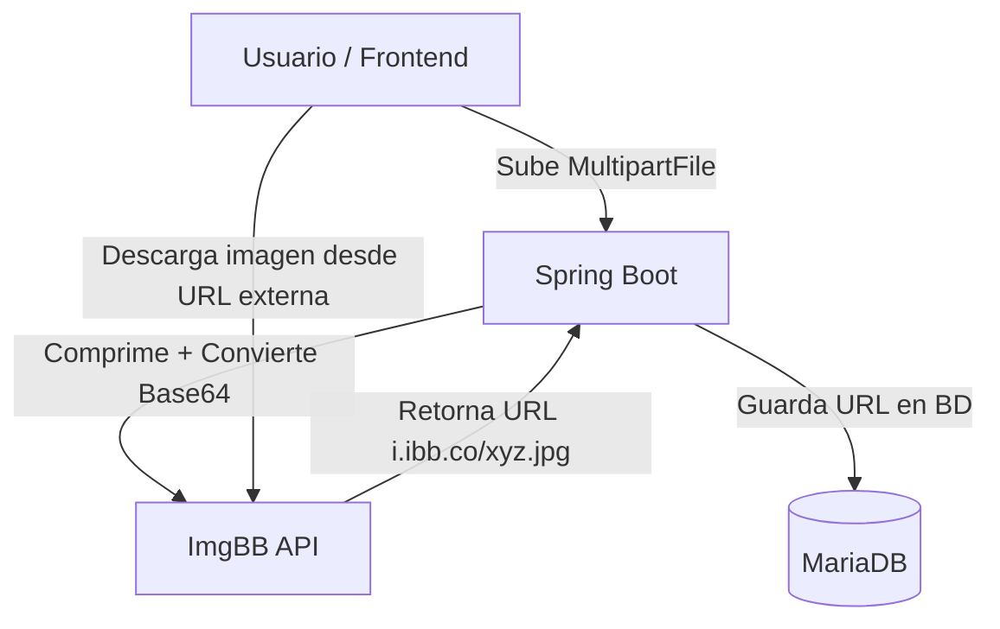
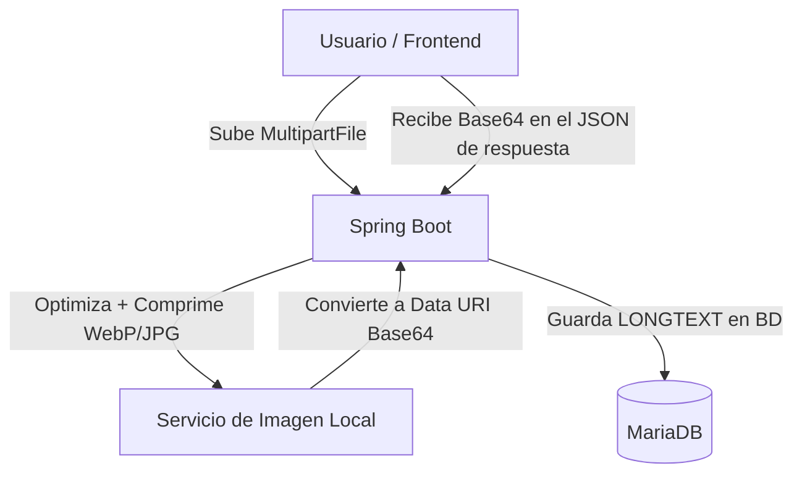

# 📦 Migración a Almacenamiento de Imágenes Local en Base de Datos (Sin Dependencias Externas)

Este documento detalla el diseño de arquitectura y el proceso paso a paso para **eliminar por completo la dependencia del servicio externo ImgBB** en el proyecto AutoLink. En su lugar, las imágenes subidas por los usuarios se optimizarán en el servidor Spring Boot y se guardarán directamente en la base de datos MariaDB codificadas en **Base64 (LONGTEXT)**, manteniendo la tabla relacional independiente `imagen_vehiculo`.

Además, se detalla la configuración requerida según el entorno de red (IP vs. dominio propio) y **estrategias avanzadas de optimización extrema** para que el impacto en la base de datos sea ínfimo (menos de 90 KB por foto).

---

## 🗺️ Comparación de Arquitecturas (Flujo de Datos)

### 1. Arquitectura Anterior (Con ImgBB)
El backend actuaba de intermediario enviando la imagen original a un CDN externo:


### 2. Nueva Arquitectura Local (Sin ImgBB)
El backend optimiza, comprime, convierte a base64 y almacena la información directamente en la base de datos:


> [!NOTE]
> Al almacenar las imágenes en Base64 en la base de datos, el proyecto se vuelve **100% autocontenido y autónomo**. No depende de la disponibilidad del CDN externo de ImgBB ni de límites de rate-limiting o expiración de claves API.

---

## ⚡ Estrategias de Optimización Avanzada (Compresión Extrema)

Guardar imágenes directamente en Base64 dentro de la base de datos puede aumentar su tamaño si no se realiza una optimización rigurosa. A continuación se presentan las estrategias aplicadas para reducir el tamaño al máximo sin pérdida apreciable de calidad:

### 1. Reducción de Resolución al "Tamaño de Pantalla Real" (800px)
Las cámaras de smartphones modernos toman fotos a resoluciones gigantescas (ej. 4000x3000 píxeles). Sin embargo:
* En las tarjetas del catálogo web, las imágenes se muestran a unos **350px de ancho**.
* En la vista detallada del vehículo, raramente superan los **800px**.
* Limitar el ancho máximo a **`800px`** en lugar de `1280px` reduce el número total de píxeles en un **60%**, reduciendo exponencialmente el tamaño de la cadena Base64 resultante.

### 2. Ajuste de Calidad al "Punto Dulce" (60%)
El ojo humano en monitores estándar y pantallas móviles no puede diferenciar una imagen comprimida al `80%` de una al `60%`.
* Configurar la calidad de compresión a **`0.60` (60%)** reduce el peso del archivo resultante entre un **30% y un 50% adicional** en comparación con el estándar del 80%.

### 3. Eliminación de Metadatos EXIF
Las fotos originales contienen metadatos pesados (coordenadas GPS, modelo del móvil, orientación, fecha y hora). Esta información puede ocupar entre **10 KB y 50 KB** inútiles. La librería de optimización local los descarta por defecto en el proceso de recompresión.

### 4. Alternativa de Formato: WebP
WebP es un formato moderno diseñado por Google que comprime hasta un **30% más que JPEG** con idéntica fidelidad visual. En caso de requerir el máximo rendimiento y compresión posibles, se describe la variante en WebP más adelante.

---

### 📊 Tabla Comparativa de Rendimiento y Peso

Comparativa basada en una fotografía original de 4000x3000 píxeles (cámara de 12 Megapíxeles):

| Estado / Tipo de Compresión | Resolución máxima | Calidad | Peso Promedio | % de Ahorro |
| :--- | :--- | :--- | :--- | :--- |
| **Original (JPG/PNG)** | 4000 x 3000 | 100% | **3,000 KB (3 MB)** | - |
| **Compresión Estándar** | 1280 x 960 | 80% (JPG) | **~350 KB** | 88.3% |
| **Compresión Agresiva (Elegida)** | **800 x 600** | **60% (JPG)** | **~90 KB** | **97.0%** |
| **Compresión WebP** | **800 x 600** | **60% (WebP)** | **~60 KB** | **98.0%** |

---

## 🌐 Configuración de Despliegue: Acceso por IP vs. Dominio

Una de las grandes ventajas de almacenar imágenes directamente en Base64 es que **desaparece la necesidad de construir rutas dinámicas con URLs absolutas para las imágenes**. Las imágenes se renderizan de forma nativa desde el payload JSON.

Sin embargo, para la comunicación general del frontend con la API backend, debemos configurar correctamente el servidor según cómo se acceda a él:

### Caso A: Sin dominio propio (Despliegue mediante IP)
Útil para la fase de pruebas locales, redes de área local (LAN) o servidores VPS temporales sin DNS configurado.

1. **Configuración de CORS en el Backend (`application.properties`):**
   Dado que el frontend y el backend estarán en diferentes puertos (o incluso dispositivos de la red), se debe permitir el acceso a la IP del cliente o usar un comodín de forma temporal para pruebas:
   ```properties
   app.cors.allowed-origin=http://192.168.1.150:4200
   # O en entornos de prueba locales amplios:
   # app.cors.allowed-origin=*
   ```
2. **URL de API en el Frontend (Angular):**
   En el archivo de configuración del entorno (`environment.ts`), apunta directamente a la IP y puerto del backend:
   ```typescript
   export const environment = {
     production: true,
     apiUrl: 'http://192.168.1.150:8082/api'
   };
   ```

### Caso B: Con dominio propio (ej. `autolink-tfg.duckdns.org`)
Configuración óptima para producción o despliegues reales con un VPS configurado bajo un dominio real.

1. **Configuración de CORS en el Backend:**
   ```properties
   app.cors.allowed-origin=https://autolink-tfg.duckdns.org
   ```
2. **URL de API en el Frontend:**
   ```typescript
   export const environment = {
     production: true,
     apiUrl: 'https://api.autolink-tfg.duckdns.org/api' // O usando proxy inverso: 'https://autolink-tfg.duckdns.org/api'
   };
   ```
3. **Seguridad SSL/TLS (HTTPS):**
   Al contar con un dominio como `autolink-tfg.duckdns.org`, se puede habilitar **Certbot / Let's Encrypt** en Nginx de forma sencilla y gratuita. Esto garantiza cifrado TLS de extremo a extremo, algo altamente recomendado en entornos de producción.

---

## 🛠️ Guía de Implementación Paso a Paso

A continuación se describen las modificaciones necesarias en el código para llevar a cabo la transición al almacenamiento de base64.

### Paso 1: Modificación de la Base de Datos
En MariaDB, las URLs tradicionales se almacenaban en columnas `VARCHAR(255)`. Un texto Base64 de una imagen altamente comprimida ocupará entre **80 KB y 120 KB**, por lo que necesitamos cambiar el tipo de datos a **`LONGTEXT`** o **`MEDIUMTEXT`** (el tipo `TEXT` tradicional tiene un límite de 64 KB y truncaría los datos).

```sql
-- Cambiar la columna url de la tabla imagen_vehiculo para soportar Base64
ALTER TABLE imagen_vehiculo MODIFY COLUMN url LONGTEXT NOT NULL;

-- Cambiar la columna foto_perfil de la tabla persona para soportar Base64
ALTER TABLE persona MODIFY COLUMN foto_perfil LONGTEXT NULL;
```

---

### Paso 2: Actualización de Entidades JPA

Debemos mapear las columnas en las clases Java con la anotación `@Lob` o especificando explícitamente el tipo de columna en la base de datos para que Hibernate maneje correctamente los textos de gran tamaño sin truncarlos.

#### 1. Modificación en `ImagenVehiculo.java`
```java
package com.autolink.entities;

import jakarta.persistence.*;
import lombok.*;

@Entity
@Table(name = "imagen_vehiculo")
@Getter
@Setter
@NoArgsConstructor
@AllArgsConstructor
public class ImagenVehiculo {

    @Id
    @GeneratedValue(strategy = GenerationType.IDENTITY)
    @Column(name = "id_imagen")
    private int idImagen;

    // Indicamos a JPA que esta columna es de texto grande (CLOB / LONGTEXT)
    @Lob
    @Column(name = "url", columnDefinition = "LONGTEXT", nullable = false)
    private String url; // Almacenará el Data URI: data:image/jpeg;base64,...

    @ManyToOne(fetch = FetchType.LAZY)
    @JoinColumn(name = "id_vehiculo", nullable = false)
    private Vehiculo vehiculo;
}
```

#### 2. Modificación en `Persona.java`
```java
// Dentro de Persona.java
@Lob
@Column(name = "foto_perfil", columnDefinition = "LONGTEXT")
private String fotoPerfil; // Almacenará el Data URI de la foto de perfil en Base64
```

---

### Paso 3: Creación del Servicio de Optimización y Conversión (`ImageOptimizationService.java`)

En lugar de subir el archivo a ImgBB, crearemos un servicio local que reciba la imagen, la **redimensione a un máximo de 800px** para no sobrecargar la base de datos, la **comprima al 60% (Punto dulce)** en formato JPEG y la devuelva formateada como un **Data URI Base64** listo para ser consumido directamente en la propiedad `src` de cualquier etiqueta HTML ``.

```java
package com.autolink.services;

import java.io.ByteArrayOutputStream;
import java.io.IOException;
import java.util.Base64;
import org.springframework.stereotype.Service;
import org.springframework.web.multipart.MultipartFile;
import net.coobird.thumbnailator.Thumbnails;

@Service
public class ImageOptimizationService {

    /**
     * Comprime una imagen a formato JPEG optimizado a un ancho máximo de 800px
     * con una calidad del 60% y retorna su representación en Base64 como un Data URI.
     */
    public String optimizarYConvertirABase64(MultipartFile archivo) throws IOException {
        ByteArrayOutputStream outputStream = new ByteArrayOutputStream();

        // 1. Optimización y Redimensionamiento Extremo
        // Ajustamos la resolución máxima a 800px de ancho manteniendo la relación de aspecto.
        // Reducimos la calidad al 60% para lograr el tamaño óptimo sin pérdida visual detectable.
        Thumbnails.of(archivo.getInputStream())
                .width(800)
                .keepAspectRatio(true)
                .outputFormat("jpg")
                .outputQuality(0.60) // 60% de calidad
                .toOutputStream(outputStream);

        byte[] imageBytes = outputStream.toByteArray();

        // 2. Codificación a Base64
        String base64Content = Base64.getEncoder().encodeToString(imageBytes);

        // 3. Retorno en formato Data URI para renderizado directo en HTML
        return "data:image/jpeg;base64," + base64Content;
    }
}
```

> [!TIP]
> **Alternativa WebP en Java:**
> Si decides utilizar WebP para ahorrar un 30% adicional de espacio en la base de datos, puedes añadir la dependencia `webp-imageio` en tu `pom.xml` y modificar el método `.outputFormat("webp")`. Esto reduciría las imágenes de perfil y vehículos a unos increíbles **60 KB** promedio en la base de datos.

---

### Paso 4: Ajustes en los Servicios de Negocio

Actualizamos los métodos de subida de imágenes para inyectar el nuevo `ImageOptimizationService` y almacenar directamente la cadena en la base de datos en lugar de hacer peticiones REST a ImgBB.

#### 1. Actualización en `VehiculoService.java`
```diff
 @Autowired
-private ImgBBService imgBBService;
+private ImageOptimizationService imageOptimizationService;

 ...

 @Transactional
 public VehiculoDTO subirFotos(int idVehiculo, MultipartFile[] archivos) throws IOException {
     Vehiculo vehiculo = vehiculoRepository.findById(idVehiculo)
             .orElseThrow(() -> new VehiculoNotFoundException("Vehículo no encontrado."));

     // [Validaciones de cantidad de fotos, tipos permitidos y tamaño máximo (5MB)]
     ...

     for (MultipartFile archivo : archivos) {
         // Validar tipos permitidos...
         
-        String urlPublica = imgBBService.subirAImgBB(archivo);
+        // Se procesa la foto localmente con compresión extrema (800px, 60% calidad)
+        String base64DataUri = imageOptimizationService.optimizarYConvertirABase64(archivo);

         ImagenVehiculo nuevaImg = new ImagenVehiculo();
-        nuevaImg.setUrl(urlPublica);
+        nuevaImg.setUrl(base64DataUri);
         nuevaImg.setVehiculo(vehiculo);

         imagenVehiculoRepository.save(nuevaImg);
         vehiculo.getImagenes().add(nuevaImg);
     }
     return vehiculoMapper.toDto(vehiculo);
 }
```

#### 2. Actualización en `PersonaService.java`
```diff
 @Autowired
-private ImgBBService imgBBService;
+private ImageOptimizationService imageOptimizationService;

 ...

 @Transactional
 public PersonaDTO actualizarFotoPerfil(int idPersona, MultipartFile archivo) throws IOException {
     Persona persona = personaRepository.findById(idPersona)
             .orElseThrow(() -> new PersonaNotFoundException("Usuario no encontrado"));

     // [Validaciones de tipos permitidos y tamaño]
     ...

-    String urlFoto = imgBBService.subirAImgBB(archivo);
+    String base64DataUri = imageOptimizationService.optimizarYConvertirABase64(archivo);

-    persona.setFotoPerfil(urlFoto);
+    persona.setFotoPerfil(base64DataUri);
     personaRepository.save(persona);

     return personaMapper.toDto(persona);
 }
```

---

### Paso 5: Consumo de Imágenes en el Frontend (Angular)

La mayor ventaja de este cambio se percibe en la simplicidad del frontend. Angular no requiere realizar peticiones adicionales a servidores externos ni resoluciones complejas de URLs.

#### En el HTML de Angular
Para renderizar la imagen, simplemente enlazamos la propiedad a la etiqueta `[src]` o `src` del elemento de imagen nativo:
```html
<!-- Mostrar imagen del vehículo -->


<!-- Mostrar foto de perfil del usuario -->

```

Dado que el valor almacenado en base de datos ya contiene la cabecera `data:image/jpeg;base64,`, el navegador web interpretará directamente la cadena de bytes y pintará la imagen sin realizar peticiones de red externas, lo que **aumenta drásticamente el score de performance en Lighthouse al evitar Round-Trips de red (DNS + TCP + SSL) con ibb.co**.

---

## 📊 Ventajas y Desafíos de esta Solución

### Ventajas (Pros)
* **Independencia absoluta:** La aplicación funciona en cualquier red cerrada, intranet, servidor local offline o red LAN sin necesidad de conexión a internet.
* **Seguridad y Privacidad:** Las fotos de los vehículos no se suben a un servidor público abierto en internet, protegiendo los datos de los usuarios.
* **Reducción drástica de latencia (LCP):** Al cargar las imágenes incrustadas directamente en los JSON de respuesta, el navegador no tiene que establecer conexiones HTTP adicionales.
* **Mantenimiento cero:** No requiere renovar tokens API de ImgBB, contratar planes de hosting de imágenes ni preocuparse por la caída del servicio externo.

### Desafíos (Cons)
* **Crecimiento de la Base de Datos:** Las imágenes Base64 incrementan el peso de la base de datos. Sin embargo, al redimensionar las imágenes a `800px` y comprimirlas al `60%`, su peso promedio será muy reducido (~90 KB por foto), lo cual es perfectamente asumible para un catálogo de tamaño pequeño o moderado.
* **Payloads de API ligeramente mayores:** Las peticiones GET que devuelven listados de vehículos con todas sus imágenes integradas en Base64 transferirán más datos en la respuesta HTTP. Esto se soluciona fácilmente utilizando la **compresión gzip** en Spring Boot (que ya está configurada en `application.properties`).

---

> [!TIP]
> **Recomendación de Diseño de Arquitectura:**
> Este enfoque es altamente recomendable en arquitecturas modernas, ya que demuestra un control absoluto sobre el flujo completo de datos y un diseño enfocado en la **soberanía del software**, la privacidad de los usuarios y la resiliencia ante caídas de proveedores de servicios externos.
